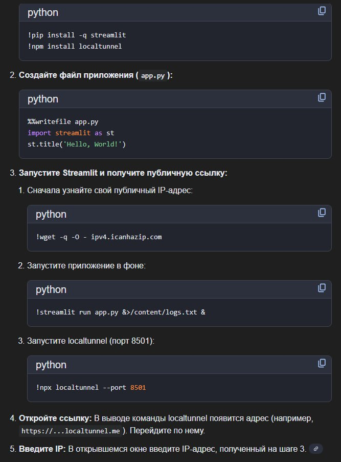

# 📊 Streamlit ML Dashboard Cheatsheet

## Часть 1: Создание ML-дашбордов

### 🚀 Базовая структура

```python
import streamlit as st
import pandas as pd
import numpy as np
import plotly.express as px
import matplotlib.pyplot as plt
from sklearn.model_selection import train_test_split
from sklearn.metrics import (accuracy_score, confusion_matrix, 
                             classification_report, roc_curve, auc)

# Настройка страницы (должна быть первой командой!)
st.set_page_config(
    page_title="ML Dashboard",
    page_icon="🤖",
    layout="wide",  # или "centered"
    initial_sidebar_state="expanded"
)

st.title("🤖 ML Dashboard")
st.markdown("---")
```

---

### 📦 Кэширование (критически важно!)

```python
# Для данных (не мутируется)
@st.cache_data
def load_data(path):
    return pd.read_csv(path)

# Для моделей и объектов (мутируется)
@st.cache_resource
def load_model(path):
    import joblib
    return joblib.load(path)

# С TTL (время жизни кэша)
@st.cache_data(ttl=3600)  # 1 час
def fetch_api_data():
    return requests.get(API_URL).json()

# Очистка кэша
if st.button("Очистить кэш"):
    st.cache_data.clear()
```

---

### 📁 Загрузка данных пользователем

```python
# Загрузка CSV
uploaded_file = st.file_uploader(
    "Загрузите датасет", 
    type=['csv', 'xlsx', 'parquet']
)

if uploaded_file is not None:
    if uploaded_file.name.endswith('.csv'):
        df = pd.read_csv(uploaded_file)
    elif uploaded_file.name.endswith('.xlsx'):
        df = pd.read_excel(uploaded_file)
    elif uploaded_file.name.endswith('.parquet'):
        df = pd.read_parquet(uploaded_file)
    
    st.success(f"Загружено: {df.shape[0]} строк, {df.shape[1]} столбцов")
    st.dataframe(df.head())
```

---

### 🎛️ Виджеты для параметров модели

```python
# --- SIDEBAR ---
st.sidebar.header("⚙️ Параметры модели")

# Выбор модели
model_type = st.sidebar.selectbox(
    "Выберите модель",
    ["Random Forest", "XGBoost", "LightGBM", "Logistic Regression"]
)

# Слайдеры для гиперпараметров
if model_type == "Random Forest":
    n_estimators = st.sidebar.slider("n_estimators", 10, 500, 100, 10)
    max_depth = st.sidebar.slider("max_depth", 1, 50, 10)
    min_samples_split = st.sidebar.slider("min_samples_split", 2, 20, 2)

# Checkbox
use_scaling = st.sidebar.checkbox("Стандартизация данных", value=True)

# Radio buttons
split_method = st.sidebar.radio(
    "Метод валидации",
    ["Train/Test Split", "K-Fold CV", "Stratified K-Fold"]
)

# Number input
test_size = st.sidebar.number_input(
    "Test size (%)", 
    min_value=10, max_value=50, value=20
) / 100

# Multiselect для выбора фичей
all_features = df.columns.tolist()
selected_features = st.sidebar.multiselect(
    "Выберите признаки",
    all_features,
    default=all_features[:5]
)

# Выбор целевой переменной
target = st.sidebar.selectbox("Целевая переменная", df.columns)
```

---

### 📊 Отображение данных и EDA

```python
# Вкладки
tab1, tab2, tab3 = st.tabs(["📊 Данные", "📈 EDA", "🤖 Модель"])

with tab1:
    # Интерактивная таблица
    st.dataframe(df, use_container_width=True)
    
    # Статистика
    col1, col2 = st.columns(2)
    with col1:
        st.subheader("Описательная статистика")
        st.write(df.describe())
    with col2:
        st.subheader("Типы данных")
        st.write(df.dtypes)

with tab2:
    # Распределение целевой переменной
    fig = px.histogram(df, x=target, title="Распределение целевой переменной")
    st.plotly_chart(fig, use_container_width=True)
    
    # Корреляционная матрица
    numeric_cols = df.select_dtypes(include=[np.number]).columns
    corr_matrix = df[numeric_cols].corr()
    fig_corr = px.imshow(corr_matrix, text_auto=True, title="Корреляционная матрица")
    st.plotly_chart(fig_corr, use_container_width=True)
```

---

### 🤖 Обучение и оценка модели

```python
with tab3:
    if st.button("🚀 Обучить модель", type="primary"):
        with st.spinner("Обучение модели..."):
            # Подготовка данных
            X = df[selected_features]
            y = df[target]
            X_train, X_test, y_train, y_test = train_test_split(
                X, y, test_size=test_size, random_state=42
            )
            
            # Обучение (пример с Random Forest)
            from sklearn.ensemble import RandomForestClassifier
            model = RandomForestClassifier(
                n_estimators=n_estimators,
                max_depth=max_depth,
                random_state=42
            )
            model.fit(X_train, y_train)
            y_pred = model.predict(X_test)
            y_prob = model.predict_proba(X_test)[:, 1]
            
            # Сохранение в session_state
            st.session_state['model'] = model
            st.session_state['y_test'] = y_test
            st.session_state['y_pred'] = y_pred
            st.session_state['y_prob'] = y_prob
        
        st.success("Модель обучена!")
```

---

### 📈 Отображение метрик

```python
# Метрики в колонках
col1, col2, col3, col4 = st.columns(4)
accuracy = accuracy_score(y_test, y_pred)
precision = precision_score(y_test, y_pred, average='weighted')
recall = recall_score(y_test, y_pred, average='weighted')
f1 = f1_score(y_test, y_pred, average='weighted')

col1.metric("Accuracy", f"{accuracy:.3f}")
col2.metric("Precision", f"{precision:.3f}")
col3.metric("Recall", f"{recall:.3f}")
col4.metric("F1-Score", f"{f1:.3f}")

# Метрики с дельтой (изменением)
col1.metric("Accuracy", f"{accuracy:.3f}", delta="+0.05")
```

---

### 📊 Визуализация результатов ML

```python
# Confusion Matrix
from sklearn.metrics import ConfusionMatrixDisplay

fig_cm, ax_cm = plt.subplots(figsize=(8, 6))
ConfusionMatrixDisplay.from_predictions(y_test, y_pred, ax=ax_cm, cmap='Blues')
ax_cm.set_title("Confusion Matrix")
st.pyplot(fig_cm)

# ROC Curve
fpr, tpr, _ = roc_curve(y_test, y_prob)
roc_auc = auc(fpr, tpr)

fig_roc = px.area(
    x=fpr, y=tpr,
    title=f'ROC Curve (AUC = {roc_auc:.3f})',
    labels=dict(x='False Positive Rate', y='True Positive Rate')
)
fig_roc.add_shape(type='line', x0=0, x1=1, y0=0, y1=1, 
                   line=dict(dash='dash', color='gray'))
st.plotly_chart(fig_roc, use_container_width=True)

# Feature Importance
if hasattr(model, 'feature_importances_'):
    importance_df = pd.DataFrame({
        'feature': selected_features,
        'importance': model.feature_importances_
    }).sort_values('importance', ascending=True)
    
    fig_imp = px.bar(importance_df, x='importance', y='feature', 
                     orientation='h', title='Feature Importance')
    st.plotly_chart(fig_imp, use_container_width=True)

# Classification Report
st.subheader("Classification Report")
report = classification_report(y_test, y_pred, output_dict=True)
st.dataframe(pd.DataFrame(report).T)
```

---

### 🔮 Предсказание на новых данных

```python
st.subheader("🔮 Предсказание")

# Форма для ввода данных
with st.form("prediction_form"):
    input_data = {}
    cols = st.columns(3)
    
    for i, feature in enumerate(selected_features):
        with cols[i % 3]:
            input_data[feature] = st.number_input(
                feature,
                value=float(df[feature].mean())
            )
    
    submitted = st.form_submit_button("Предсказать")
    
    if submitted:
        input_df = pd.DataFrame([input_data])
        prediction = model.predict(input_df)
        probability = model.predict_proba(input_df)
        
        st.success(f"**Предсказание:** {prediction[0]}")
        st.info(f"**Вероятности:** {probability[0]}")
```

---

### 💾 Экспорт модели и результатов

```python
import joblib
from io import BytesIO

# Скачивание модели
if 'model' in st.session_state:
    model_buffer = BytesIO()
    joblib.dump(st.session_state['model'], model_buffer)
    model_buffer.seek(0)
    
    st.download_button(
        label="📥 Скачать модель (.pkl)",
        data=model_buffer,
        file_name="trained_model.pkl",
        mime="application/octet-stream"
    )

# Скачивание результатов CSV
results_df = pd.DataFrame({
    'actual': y_test, 
    'predicted': y_pred, 
    'probability': y_prob
})
csv = results_df.to_csv(index=False)
st.download_button(
    label="📥 Скачать предсказания (CSV)",
    data=csv,
    file_name="predictions.csv",
    mime="text/csv"
)
```

---

### 🎨 Продвинутые элементы

```python
# Прогресс-бар
progress_bar = st.progress(0)
for i in range(100):
    progress_bar.progress(i + 1)

# Статус
with st.status("Обучение модели...", expanded=True) as status:
    st.write("Загрузка данных...")
    time.sleep(1)
    st.write("Обучение...")
    time.sleep(2)
    st.write("Валидация...")
    time.sleep(1)
    status.update(label="Готово!", state="complete", expanded=False)

# Expander
with st.expander("📖 Подробности модели"):
    st.write("Здесь детальная информация...")
    st.json(model.get_params())

# Контейнер с отступами
with st.container(border=True):
    st.write("Контент в рамке")

# Пустой placeholder для динамического обновления
placeholder = st.empty()
placeholder.text("Обновляется...")
placeholder.metric("Live Metric", value)
```

---

### 📱 Session State (сохранение состояния)

```python
# Инициализация
if 'trained' not in st.session_state:
    st.session_state.trained = False
    st.session_state.model = None
    st.session_state.history = []

# Использование
if st.button("Обучить"):
    # ... обучение ...
    st.session_state.trained = True
    st.session_state.model = model
    st.session_state.history.append({'accuracy': acc, 'time': datetime.now()})

# Проверка
if st.session_state.trained:
    st.success("Модель готова к использованию")
```

---

## Часть 2: Запуск Streamlit в Google Colab

### 🔧 Метод 1: LocalTunnel (рекомендуемый)

```python
# Ячейка 1: Установка
!pip install streamlit -q

# Ячейка 2: Создание файла приложения
%%writefile app.py
import streamlit as st
import pandas as pd
import numpy as np

st.title("🚀 ML Dashboard в Colab")
st.write("Это работает!")

# Ваш код дашборда здесь
uploaded = st.file_uploader("Загрузите данные")
if uploaded:
    df = pd.read_csv(uploaded)
    st.dataframe(df)

# Ячейка 3: Установка localtunnel и запуск
!npm install -g localtunnel

# Ячейка 4: Запуск в фоне + туннель
!streamlit run app.py --server.port 8501 &>/dev/null &

# Ячейка 5: Создание туннеля
!npx localtunnel --port 8501
```

> ⚠️ **Важно:** При первом открытии ссылки нужно ввести пароль (IP-адрес Colab). Скопируйте его из:
```python
!curl -s https://ipv4.icanhazip.com
```

---

### 🔧 Метод 2: ngrok (стабильный)

```python
# Ячейка 1: Установка
!pip install streamlit pyngrok -q

# Ячейка 2: Создание app.py (как выше)
%%writefile app.py
import streamlit as st
st.title("ML Dashboard")
# ... ваш код ...

# Ячейка 3: Настройка ngrok (нужен бесплатный аккаунт)
from pyngrok import ngrok

# Получите токен на https://dashboard.ngrok.com/get-started/your-authtoken
ngrok.set_auth_token("ВАШ_NGROK_AUTH_TOKEN")

# Ячейка 4: Запуск
!nohup streamlit run app.py --server.port 8501 &

# Ячейка 5: Создание туннеля
public_url = ngrok.connect(8501)
print(f"🔗 Откройте: {public_url}")
```

---

### 🔧 Метод 3: Cloudflared (без регистрации)

```python
# Ячейка 1: Установка
!pip install streamlit -q
!wget -q https://github.com/cloudflare/cloudflared/releases/latest/download/cloudflared-linux-amd64 -O cloudflared
!chmod +x cloudflared

# Ячейка 2: Создание app.py
%%writefile app.py
import streamlit as st
st.title("🎯 ML Dashboard")
# ваш код

# Ячейка 3: Запуск Streamlit
import subprocess
subprocess.Popen(["streamlit", "run", "app.py", "--server.port", "8501"])

# Ячейка 4: Туннель
!./cloudflared tunnel --url http://localhost:8501
```

---

### 🎯 Полный готовый пример для Colab

```python
# ===========================================
# ЯЧЕЙКА 1: УСТАНОВКА
# ===========================================
!pip install streamlit pandas numpy scikit-learn plotly xgboost -q
!npm install -g localtunnel -q

# ===========================================
# ЯЧЕЙКА 2: СОЗДАНИЕ ПРИЛОЖЕНИЯ
# ===========================================
%%writefile ml_app.py
import streamlit as st
import pandas as pd
import numpy as np
from sklearn.datasets import load_iris, load_wine
from sklearn.model_selection import train_test_split
from sklearn.ensemble import RandomForestClassifier
from sklearn.metrics import accuracy_score, classification_report
import plotly.express as px

st.set_page_config(page_title="ML Demo", layout="wide")
st.title("🤖 Machine Learning Dashboard")

# Sidebar
st.sidebar.header("⚙️ Настройки")
dataset_name = st.sidebar.selectbox("Датасет", ["Iris", "Wine"])
n_estimators = st.sidebar.slider("n_estimators", 10, 200, 100)
test_size = st.sidebar.slider("Test size", 0.1, 0.5, 0.2)

# Загрузка данных
@st.cache_data
def load_dataset(name):
    if name == "Iris":
        data = load_iris()
    else:
        data = load_wine()
    df = pd.DataFrame(data.data, columns=data.feature_names)
    df['target'] = data.target
    return df, data.target_names

df, target_names = load_dataset(dataset_name)

# Отображение данных
tab1, tab2, tab3 = st.tabs(["📊 Данные", "📈 Визуализация", "🤖 Модель"])

with tab1:
    st.dataframe(df.head(20))
    col1, col2 = st.columns(2)
    col1.metric("Строк", df.shape[0])
    col2.metric("Признаков", df.shape[1]-1)

with tab2:
    fig = px.scatter_matrix(df, dimensions=df.columns[:-1][:4], 
                            color='target', title="Scatter Matrix")
    st.plotly_chart(fig, use_container_width=True)

with tab3:
    if st.button("🚀 Обучить модель", type="primary"):
        X = df.drop('target', axis=1)
        y = df['target']
        X_train, X_test, y_train, y_test = train_test_split(
            X, y, test_size=test_size, random_state=42
        )
        
        with st.spinner("Обучение..."):
            model = RandomForestClassifier(n_estimators=n_estimators, random_state=42)
            model.fit(X_train, y_train)
            y_pred = model.predict(X_test)
            acc = accuracy_score(y_test, y_pred)
        
        st.success(f"✅ Accuracy: {acc:.3f}")
        
        # Feature Importance
        imp_df = pd.DataFrame({
            'feature': X.columns,
            'importance': model.feature_importances_
        }).sort_values('importance', ascending=True)
        
        fig = px.bar(imp_df, x='importance', y='feature', 
                     orientation='h', title='Feature Importance')
        st.plotly_chart(fig, use_container_width=True)

# ===========================================
# ЯЧЕЙКА 3: ПОЛУЧЕНИЕ IP (для LocalTunnel)
# ===========================================
import urllib.request
external_ip = urllib.request.urlopen('https://ipv4.icanhazip.com').read().decode('utf-8').strip()
print(f"📋 Ваш IP-адрес (используйте как пароль): {external_ip}")

# ===========================================
# ЯЧЕЙКА 4: ЗАПУСК STREAMLIT
# ===========================================
!streamlit run ml_app.py --server.port 8501 &>/dev/null &

# ===========================================
# ЯЧЕЙКА 5: СОЗДАНИЕ ТУННЕЛЯ
# ===========================================
!npx localtunnel --port 8501
```

---

### ⚠️ Важные замечания

| Проблема | Решение |
|----------|---------|
| LocalTunnel просит пароль | Введите IP из `curl ipv4.icanhazip.com` |
| Приложение не запускается | Подождите 5-10 секунд после запуска |
| Ошибка порта занят | `!kill -9 $(lsof -t -i:8501)` |
| Туннель отвалился | Перезапустите ячейку с туннелем |
| ngrok лимиты | Бесплатно 1 туннель, нужна регистрация |

---

### 🔄 Полезные команды

```python
# Убить все процессы Streamlit
!pkill -f streamlit

# Проверить запущенные процессы
!ps aux | grep streamlit

# Освободить порт
!fuser -k 8501/tcp

# Логи Streamlit
!streamlit run app.py 2>&1 | head -50
```

